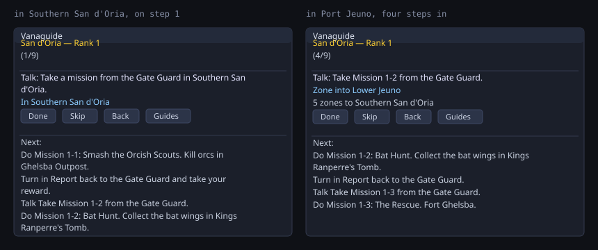
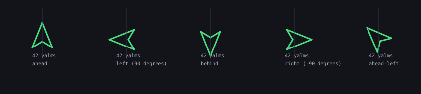
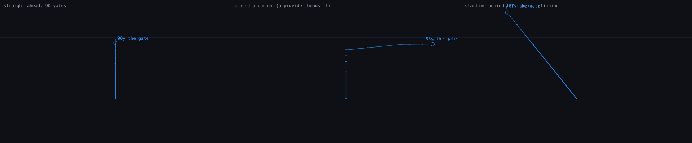
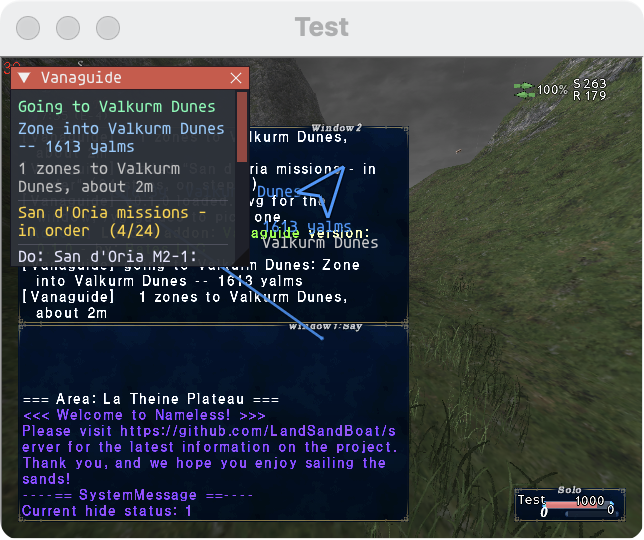

# Vanaguide — a guided walkthrough for FINAL FANTASY XI

*What Zygor is to World of Warcraft, for Vana'diel.* An Ashita v4 addon that shows the next
thing to do, ticks it off when the **server** says you have done it, and points an arrow at
where to go — routing you across zones, airships and ferries when "there" is a continent away.

**Status: v0.1.0 — the engine is complete, tested offline, and confirmed running in a live
client.** Read [docs/VERIFICATION.md](docs/VERIFICATION.md) for exactly what has been watched
happening and what has not.

| Zygor feature | Vanaguide |
| --- | --- |
| Guide viewer whose steps auto-complete | ✅ `core/progress.lua` + `core/conditions.lua` |
| Steps that know what the game knows | ✅ `core/story.lua` reads the quest/mission log out of packet `0x056` — the same bookkeeping your in-game log shows |
| Waypoint arrow with distance | ✅ `ui/arrow.lua`, drawn on ImGui's foreground list so it works under DXVK on the Mac port |
| A line on the ground showing the way | ✅ `ui/line.lua` — the route drawn in the world, with dots crawling towards the target ([docs/LINE.md](docs/LINE.md)). `/vg line off` if you would rather not |
| A path that goes *around* the wall | ✅ `routing/navgrid.lua` — an A\* over the server's own navigation meshes, searched a few hundred cells a frame so the client never stutters. The grids are built from a LandSandBoat checkout you already have and are **not shipped** ([docs/NAVMESH.md](docs/NAVMESH.md)); without them the line is straight |
| Travel routing (flight paths, boats) | ✅ `routing/zonegraph.lua` — Dijkstra over the zone graph, with airships and the Selbina/Mhaura ferry as real edges |
| Routing that points at the *doorway*, not the zone's name | ✅ `routing/zonepoints.lua` — 783 zone-line coordinates and 14 docks, so the arrow and the distance work for the whole journey, not just the last hop |
| "Take me to X" | ✅ `/vg goto <zone>`, with or without a guide loaded |
| A travel graph that is actually complete | ⚠️ partly. The seed graph covers the base world; **the addon learns every zone line you walk through** and saves it, so it fills itself in from play instead of from guesswork |
| Gear finder / "where does this drop?" | ✅ `/vg find`, `/vg gear <slot>`, `/vg nm` over 365 notorious monsters, 1,167 purchasable items and 485 sourced equipment pieces ([docs/LOOT_AND_HUNTING.md](docs/LOOT_AND_HUNTING.md)) |
| Guide library | **505 quests and 459 missions**, generated from server data into 25 guides — one per quest area, one per storyline ([docs/QUEST_DATABASE.md](docs/QUEST_DATABASE.md)) — plus hand-written guides in `Vanaguide/guides/` |
| Guide editor | ❌ — but `/vg mark` writes a paste-ready guide line for wherever you are standing |

## Install

```sh
tools/install.sh "/path/to/your/FFXI install"     # copies Vanaguide/ into addons/
```

Then `/addon load vanaguide` (or add it to `scripts/default.txt`), and `/vg`.

**Before you install it on a private server, read [docs/SERVERS.md](docs/SERVERS.md).**
Most FFXI private servers ban addons that are not on their published allowlist, and
Vanaguide is on nobody's list yet. On HorizonXI, CatsEyeXI and FFEra it is *not approved*.
Run it on your own LandSandBoat world, or ask the server first. This is not a formality —
people lose accounts over it.

## What it looks like

The guide window, drawn from the widget calls the real `ui/window.lua` makes — on the left
the step is in this zone, on the right it is a continent away and the router has taken over:



The arrow, at five bearings (`tools/render_arrow.lua`):



And the line on the ground, drawn by the real `ui/line.lua` through a hand-built camera
(`tools/render_line.lua`) — straight ahead, bent around a corner, and climbing:



None of those is a screenshot. This is:



*La Theine Plateau, `/vg goto Valkurm Dunes`: the window says where it is taking you and how
far, the line runs off towards the zone line 1,613 yalms away, and the arrow agrees with it.*
See [docs/VERIFICATION.md](docs/VERIFICATION.md) for what that does and does not prove.

## Commands

| | |
| --- | --- |
| `/vg` | show / hide the guide window |
| `/vg guides` | list the guides, numbered |
| `/vg load 7` | load one by number (the window's buttons cannot be clicked on the Mac port — see [docs/MOUSE.md](https://github.com/danielalanbates/HorizonXI-on-Mac/blob/master/docs/MOUSE.md)) |
| `/vg next` · `back` · `skip` | move through the current guide |
| `/vg route` | the route to the current step, one line per leg, saying which legs it can point at |
| `/vg goto <zone>` | route to any zone by name or id; `/vg goto off` to stop |
| `/vg line` | the line on the ground, on or off — also `style solid\|dots\|both`, `width <px>`, `probe` ([docs/LINE.md](docs/LINE.md)) |
| `/vg nav` | whether a navigation grid is loaded for this zone ([docs/NAVMESH.md](docs/NAVMESH.md)) |
| `/vg graph suspect` | the seed zone-line pairs the server's own table contradicts |
| `/vg find <item>` | where an item drops or who sells it |
| `/vg gear <slot>` | gear your job can wear now, with sources |
| `/vg nm [name]` | notorious monsters here, or by name |
| `/vg track <n>` | point the arrow at a lookup result |
| `/vg mark <name>` | write a guide line for where you stand into `marks.txt` |
| `/vg arrow move <across%> <down%>` | put the arrow where you want it (dragging is impossible — this client gives Ashita no mouse buttons) |
| `/vg arrow flip` · `nudge <deg>` | fix the arrow if it points the wrong way ([docs/ARROW.md](docs/ARROW.md)) |
| `/vg status` · `/vg story` | what the addon can see, and what the server has told it |
| `/vg reset` | start the current guide again |

## Layout

```
Vanaguide/            the addon — copy this folder into <install>/addons/
  core/       util (everything that touches the game), story (packet 0x056),
              guide (the format + parser), conditions, progress
  routing/    zonegraph (Dijkstra + learned zone lines), router (what to do next),
              zonepoints (where the doorways are), path (the points to draw),
              navgrid (A* over the server's navmeshes, when you have built them)
  data/       zone_names.lua, zonelines.lua, zonepoints.lua (all generated),
              travel.lua (the hand-written seed graph)
  ui/         window (ImGui), arrow, line (the path in the world), project (world to screen)
  guides/     the shipped guides
tools/        install.sh, stubs.lua + test_offline.lua (offline harness), gen_zones.py
docs/         format, routing, packets, arrow calibration, verification, pathways
```

## Testing

```sh
luajit tools/test_offline.lua      # 1612 assertions, no game required
luajit tools/render_line.lua       # docs/line-geometry.svg, to look at the line
tools/line_check.py --game …       # the routing and the camera, in a running client
```

The harness fakes Ashita's globals (`tools/stubs.lua`), so the parser, the completion
conditions, the packet reader, the progress cursor and the router are all exercised without
launching anything.

Beyond the unit tests, every quest and every mission is checked twice — against the server's
own `npc_list`, and by standing a character on the coordinate in a running client:

```sh
tools/npc_positions.py --kind quest    # all 505 against the server data, about a second
tools/verify_quests.py --game …        # stand on each one; resumable, unattended
tools/settle_probe.py --game …         # how long a zone really takes to load
tools/capability_check.py --game …     # the things only a live client can answer
tools/ledger.py status                 # where it stands
tools/gen_navgrid.py <lsb checkout>    # navigation grids, if you want paths round walls
tools/nav_preview.py <grid.vgnav>      # look at one, and count how many pieces it is in
```

**501 of 505 quests and 357 of 459 missions are confirmed correct**, and every entry that
carries a place has been stood on. What each check can and cannot prove — and why a miss is
usually not a bad coordinate — is in
[docs/QUEST_VERIFICATION.md](docs/QUEST_VERIFICATION.md); the current results are in
[docs/QUEST_VERIFICATION_RESULTS.md](docs/QUEST_VERIFICATION_RESULTS.md) and
[docs/MISSION_VERIFICATION_RESULTS.md](docs/MISSION_VERIFICATION_RESULTS.md).

The sweep waits for the world instead of guessing at it. A teleport empties the client's
entity table and it refills all at once about seventeen seconds later, so a check made too
early sees nothing and cannot tell that it is early — which is how hundreds of NPCs came to be
recorded as missing from a server that spawns them perfectly well. It is measured, not
assumed: `data/settle_probe.csv`.

## Documentation

* [docs/LOOT_AND_HUNTING.md](docs/LOOT_AND_HUNTING.md) — gear, drops and notorious monsters, and how thin the open drop data really is
* [docs/QUEST_DATABASE.md](docs/QUEST_DATABASE.md) — the 505-quest database, and why it comes from server code rather than a wiki
* [docs/QUEST_VERIFICATION.md](docs/QUEST_VERIFICATION.md) — two checks, what each proves, and the ledger that tracks them
* [docs/GUIDE_FORMAT.md](docs/GUIDE_FORMAT.md) — how to write a guide
* [docs/ROUTING.md](docs/ROUTING.md) — the travel graph and how it learns
* [docs/PACKETS.md](docs/PACKETS.md) — how quest and mission completion is read
* [docs/ARROW.md](docs/ARROW.md) — the one thing that needs calibrating in-game
* [docs/VERIFICATION.md](docs/VERIFICATION.md) — what is proven and what is not
* [docs/PATHWAYS.md](docs/PATHWAYS.md) — where this goes next, for whoever picks it up
* [docs/SERVERS.md](docs/SERVERS.md) — the addon-policy problem, honestly
* [docs/INSTALL_MAC.md](docs/INSTALL_MAC.md) — installing into FFXI-on-Mac, and loading it only where it is allowed

## Credits

Written for [FFXI-on-Mac](https://github.com/danielalanbates/HorizonXI-on-Mac), and modelled
on [CompletionRoute](https://github.com/danielalanbates/openroute), the same author's WoW
guide addon. The reading of packet `0x056` follows the public description in
[ffxi-journal](https://github.com/AndreWesleyPS/ffxi-journal) (MIT); zone ids come from
[LandSandBoat](https://github.com/LandSandBoat/server)'s `zone_settings.sql`. No code from
either is copied here.

FINAL FANTASY XI © SQUARE ENIX. This is an unofficial fan project, not affiliated with or
endorsed by Square Enix, or by any private server.

## Licence

PolyForm Noncommercial 1.0.0 with a commercial-use rider — see [LICENSE](LICENSE).
Copyright © 2026 Daniel Bates / Bates LLC. All rights reserved.
Questions: help@batesai.org · <https://batesai.org>
