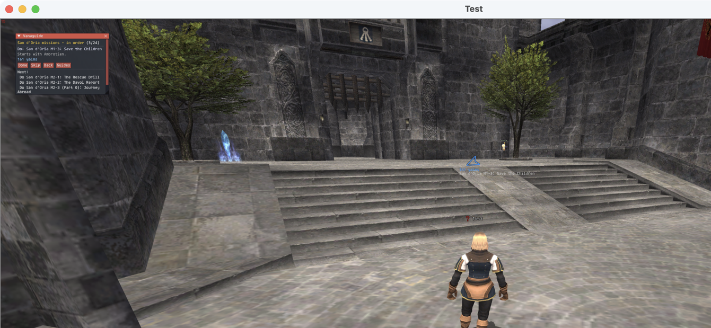

# What is proven, and what is not

Updated 2026-08-22, **after a full run on a live LandSandBoat server**. Everything in the
first section was watched happening in the game; everything in the second is still open.

*Southern San d'Oria, character on a local LandSandBoat world: the guide window on step 3 of
24, the arrow in the world with the step under it, 161 yalms to the NPC who starts it.*

## Verified in the game

| | how |
| --- | --- |
| The addon loads | `/addon list` reports `Vanaguide 0.1.0 — State: Ok` |
| The guide window draws, with the step, the distance, the buttons and the next four steps | screenshot above |
| The arrow draws in the world, coloured, labelled with the step | screenshot above |
| `/vg guides` lists all 38 guides, numbered | in-game chat |
| `/vg load <n>` loads by number and reports the step it resumed on | in-game chat |
| **Quest and mission flags arrive and parse** — 28 `0x056` packets at login, all ten quest areas, the current mission of every storyline | `/vg story` |
| **A step completes itself when the server says so** — `!addmission 0 0` + `!completemission 0 0` on the live server moved the guide from step 1 to step 2 without touching the addon; completing mission 1 moved it to step 3 | `/vg status` before and after |
| Progress persists across a client restart | reloaded on the right step after a relaunch |
| `/vg find <item>` returns real vendors, prices, cities and quest sources | in-game chat |
| `/vg nm <name>` and `/vg track <n>` find a monster and make it the arrow's target | in-game chat |
| Position, zone and heading are read correctly | `/vg status` against known coordinates |
| The router's distance is right | 161 yalms to Ambrotien, matching the generated data |

## Five bugs the in-game run found, all fixed

1. **ImGui is a module, not a global.** `_G.imgui` is nil in Ashita v4; it is
   `require('imgui')`. The window and arrow silently never drew while every command worked.
2. **65535 means "no mission active", not "past every mission".** A fresh character reports
   it for every storyline, and `current > id` then marked all 24 San d'Oria missions
   complete — the guide jumped straight to the end. Now anything ≥ 65535 is "not started".
3. **Completed nation missions live on packet page `0x00D0`.** Completing a mission clears
   the current number back to 65535, so without this page a finished mission leaves no trace.
   Identified by watching bit 0 turn on after `!completemission 0 0`, then bits 0,1 after
   mission 1 — not from anyone's table.
4. **The horizontal axes are X and Y; Z is height.** Ashita's `position_t` names them
   X, Z, Y, and reading `.Z` as the second horizontal number made every distance wrong.
   Standing on the flat plaza reported Z = 0.0, which is the height.
5. **ImGui packs colour as `0xAABBGGRR`.** Written as ARGB, the "far" blue drew orange.

Plus two things that were not code: the FFXI chat font has no em dash (guide names printed
garbage — now plain hyphens), and `/addon load` placed **before** `/load Addons` in a boot
script is silently ignored, which is why `winecursor` did not load until the line moved below
the plugin block.

## Verified without the game

`luajit tools/test_offline.lua` — 1,471 assertions covering the parser, the completion
conditions, the `0x056` bit maths (including the two packet shapes above), the progress
cursor, the router, the generated databases and the arrow's rotation.

## Still not verified

Five of the six below were open for the same reason and it was not the interesting one: every
`/vg` command answers into the game's chat log, and a script driving the client through
`cmd.txt` cannot read chat. `/vg tee <file>` copies printed lines to a file, `/vg graph` reads
the learned zone graph back, and `tools/capability_check.py` walks the list. The sixth needs
somebody to walk.

1. **Quest completion flags.** Missions are proven end to end; the `Q` tag's page ids
   (`0x0090` and friends) were parsed from a live server but the character had zero completed
   quests, so nothing has been watched turning on. `!completequest 0 <id>` would settle it.
2. **Travel routing across zones.** Everything so far happened inside Southern San d'Oria.
   `/vg route` has not been run against a step in another zone with a real walk to follow.
3. **Zone-line learning.** The character has not crossed a zone line yet.
4. **`/vg mark`.** Not run in this session.
5. **The arrow's *direction*** is consistent with the maths and with observed movement
   (walking away increased the distance, and the bearing changed as the heading did), but
   nobody has followed it to a target and arrived.
6. **Anything on a real server.** This was a private LandSandBoat world. See
   [SERVERS.md](SERVERS.md): Vanaguide is on no public server's allowlist.

## How this run was driven

The client cannot be typed into reliably from a script — Return opens the chat line only when
nothing is targeted, so a stray target turns every command into "Target out of range". The
addon therefore reads `addons/Vanaguide/cmd.txt` once a frame and runs each line, which is how
every command above was sent. Write a line, wait a second, screenshot. It executes only what a
player could type.
